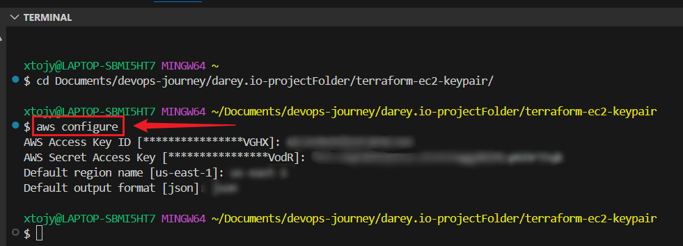
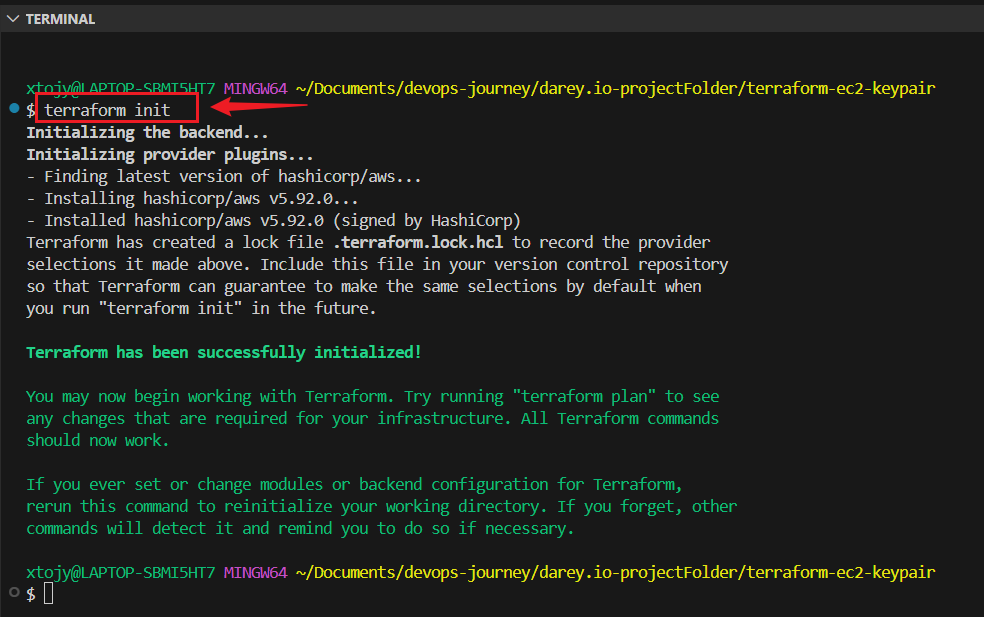
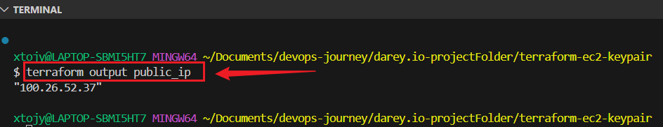
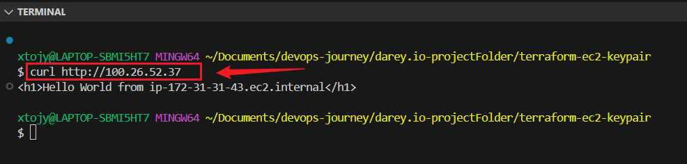
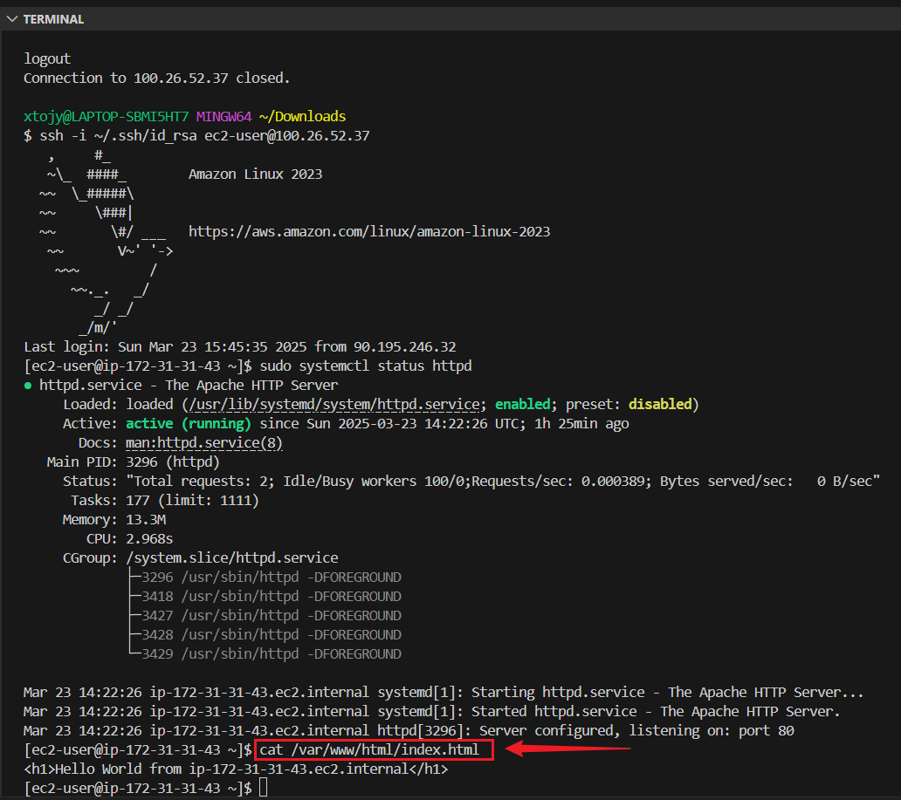
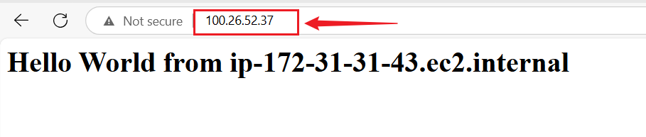

# 🚀 Terraform EC2 Instance with Key Pair & User Data

 ## Project Overview

This project uses **Terraform** to Automate the provisioning of an AWS EC2 instance using Terraform with:

✅ Auto-generated SSH Key Pair (downloadable for access)

✅ Security Group allowing HTTP (80) & SSH (22) traffic

✅ User Data Script to install Apache Web Server

✅ Public IP Output for easy access

## 🎯 Objectives
🔹 Deploy EC2 with Terraform

🔹 Generate & Manage SSH Keys

🔹 Configure Security Groups

🔹 Install Apache via User Data

🔹 Output Public IP for verification

## ⚡ Prerequisites

✅ Terraform & AWS CLI installed

✅ IAM User with AWS access

✅ Basic AWS & Terraform knowledge (optional)

---

## Setup Instructions:

🔹Use aws configure to provide AWS credentials and set up region.
```
aws configure
```


Verify Configuration and Test Setup
```
aws sts get-caller-identity
aws ec2 describe-regions --output table
```

---

### Task 1: Terraform Configuration for EC2 Instance

### Create a Project Directory: Open a terminal and run:
```
mkdir terraform-ec2-keypair
cd terraform-ec2-keypair
```

### Create the Terraform Configuration File
Create and open the main.tf file:
```
nano main.tf
```

**put this inside it:**

```
# Define AWS Provider
provider "aws" {
  region = "us-east-1"  # Change to your preferred region
}

# Generate Key Pair
resource "aws_key_pair" "example_keypair" {
  key_name   = "example-keypair"
  public_key = file("~/.ssh/id_rsa.pub")  # Replace with the path to your public key
}

# Create a Security Group to Allow HTTP (Port 80) Traffic
resource "aws_security_group" "web_sg" {
  name        = "allow_http"
  description = "Allow HTTP traffic"

  ingress {
    from_port   = 80
    to_port     = 80
    protocol    = "tcp"
    cidr_blocks = ["0.0.0.0/0"]
  }

  ingress {
    from_port   = 22
    to_port     = 22
    protocol    = "tcp"
    cidr_blocks = ["0.0.0.0/0"]
  }

  egress {
    from_port   = 0
    to_port     = 0
    protocol    = "-1"
    cidr_blocks = ["0.0.0.0/0"]
  }
}

# Launch an EC2 Instance
resource "aws_instance" "example_instance" {
  ami           = "ami-08b5b3a93ed654d19"  # Replace with your preferred AMI ID
  instance_type = "t2.micro"
  key_name      = aws_key_pair.example_keypair.key_name
  vpc_security_group_ids = [aws_security_group.web_sg.id]

  user_data = <<-EOF
    #!/bin/bash
    yum update -y
    yum install -y httpd
    systemctl start httpd
    systemctl enable httpd
    echo "<h1>Hello World from $(hostname -f)</h1>" > /var/www/html/index.html
  EOF

  tags = {
    Name = "Terraform-Web-Server"
  }
}

# Output Public IP
output "public_ip" {
  value = aws_instance.example_instance.public_ip
}
```

### Apply the Terraform Configuration 

Initialize Terraform the configuration:
```
terraform init
```



**Validate and Plan Terraform Deployment**

Before applying the changes, check if the configuration is correct:
```
terraform validate
```

**Run the plan command to see what Terraform will create:**
```
terraform plan
```

**Apply the Terraform Configuration**

Deploy the resources using:
```
terraform apply
```

**Verify Resources**
```
aws ec2 describe-instances
aws ec2 describe-images --owners self
```

Confirm with yes when prompted.

Terraform will now: 

✅ Create a Key Pair

✅ Create a Security Group

✅ Launch an EC2 instance

✅ Run a User Data script to install Apache


**Get the EC2 Public IP and Test the Web Server**

Once Terraform finishes deploying, it will output the public IP address.

You can check with Terraform Output
```
terraform output public_ip
```



**Test Connectivity On Terminal**
```
curl http://<Public-IP>
```
**Check if index.html file was created corrected:**
```
cat /var/www/html/index.html
```



## Accessing Apache web server using public_IP

Copy the IP and open it in browser:
```
http://100.26.52.37
```



## 🛑 Destroying the Resources (Cleanup)

To remove all resources created by Terraform, run:
```
terraform destroy
```
Type yes when prompted.

## 📝 Observations, Challenges & Conclusion

## 📌 Observations

- Terraform simplifies EC2 instance provisioning and automation.

+ Key Pair generation ensures secure SSH access.

+ User Data script effectively installs and configures Apache Web Server.

+ Proper security group settings are essential for HTTP & SSH access.

## 🚧 Challenges & Solutions

I did not encounter any major challenge. 


## 🏁 Conclusion

This project demonstrated Infrastructure as Code (IaC) with Terraform, automating AWS EC2 deployment.  
It highlighted the importance of security settings, key management, and automated server provisioning.


### Create a New GitHub Repository named:
```
terraform-ec2-keypair
```

### Initialize Git:
```
git init
```

### Add Your .gitignore File
```
git add .gitignore
```

### Stage Other Files
```
git add .
```

### Make the Initial Commit
```
git commit -m "Initial commit with .gitignore"
```

### Connect to a Remote Repository (Optional)
```
git remote add origin https://github.com/yourusername/your-repository.git
```

### Push Your Code to the Remote Repository
```
git push -u origin main
```

### Verify the .gitignore is Working
```
git status
```
